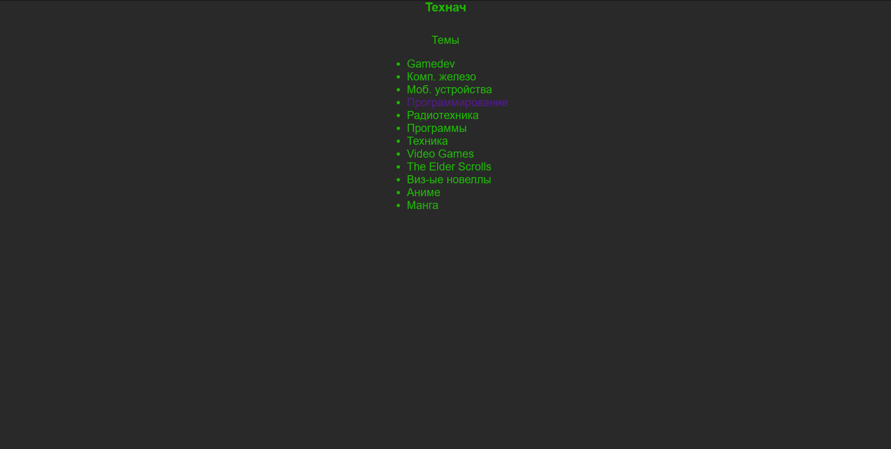
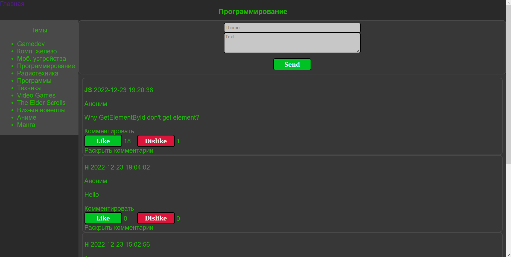
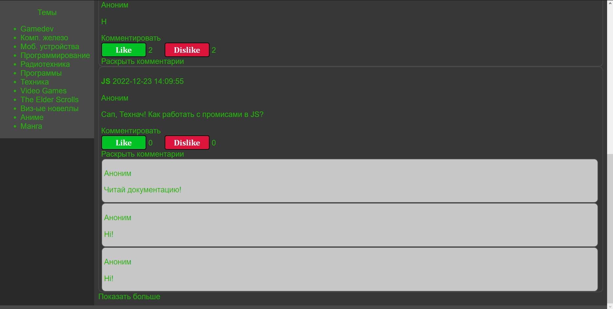
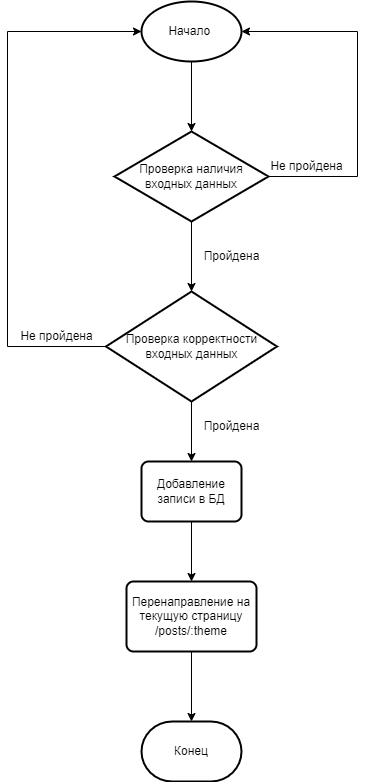
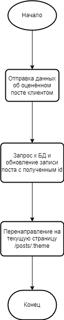
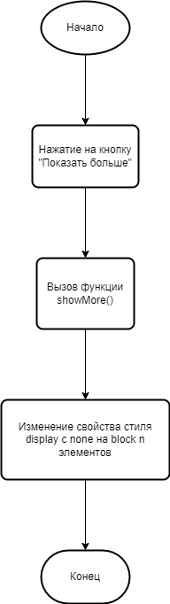
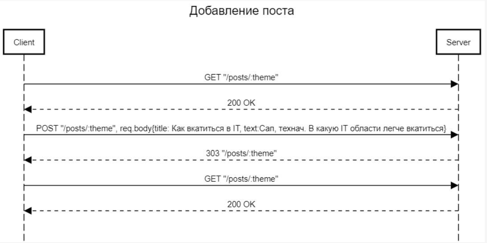
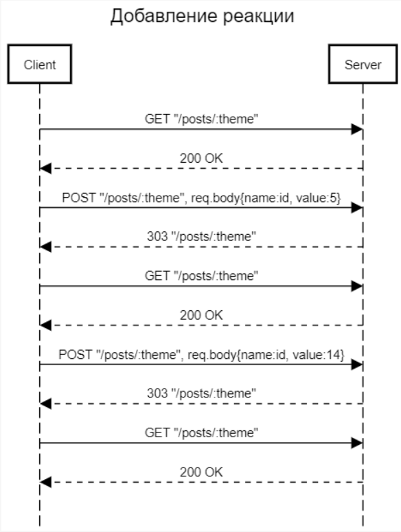

# Отчёт к лабораторной работе №2
----
# Текст задания
## Цель работы
Разработать и реализовать клиент-серверную информационную систему, реализующую механизм CRUD
## Минимальные требования
- добавление текстовых заметок в общую ленту
- реагирование на чужие заметки(лайки) 
## Дополнительные возможности
- добавление комментариев к чужим заметкам
- "раскрывающиеся" комментарии
- реакции разных видов(лайк/дизлайк/...)
- добавление изображений к заметкам
 - комментирование второго уровня
 ## Выполнено
 - добавление текстовых заметок в общую ленту
- реагирование на чужие заметки(лайки)
- добавление комментариев к чужим заметкам
- "раскрывающиеся" комментарии
- реакции разных видов(лайк/дизлайк/...)

 ----
# Ход работы
## Пользовательский интерфейс
Имеется два вида страниц: главная страница сайта(навигация), лента с заметками
1. Страница навигации



2. Лента заметок



3. Кнопка раскрытия заметок



## Пользовательские сценарии работы
1. При вводе в адресной строке "/" выводится меню навигации, где у пользователя есть возможность выбрать тему обсуждения 
2. При вводе в адресной строке "/posts/:theme", где theme - выбранная тема, пользователю выводится лента с постами и форма добавления новой заметки. На каждой заметке имеется кнопка реакции
    1. При отправке новой заметки, страница обновляется и отправленный пост отображается последним в ленте;
    2. Внизу списка заметок имеется кнопка "Показать больше", при нажатии на которую пользователю выводятся последующие n(по умолчанию 10) заметок;
    3. При нажатии на кнопку реакции, страница обновляется, а счётчик реакции увеличивается на единицу

## Описание API сервера, хореографии
В основе приложения использована клиент-серверная архитектура. Обмен данными между клиентом и сервером осуществляется с помощью HTTP GET и POST запросов. В теле POST запроса отправки поста используются следующие поля: title, text. Для увеличения счётчика реакции используется форма с POST запросом. В теле POST запроса реакции используются следующие поля: name, value. 
1. Описание процесса отправки новой заметки: Клиент отправляет GET запрос на получение страницы по адресу "/posts/(theme)". Выводится лента заметок, посвящённых теме, выбранной пользователем. При отправке данных заметки POST запросом проверяется их корректность (отсутствие HTML символов), в случае некорректности отправка прерывается. После данные из полей title, text и picture заносятся в БД. Происходит перенаправление пользователя на эту же страницу с обновлением ленты постов.
2. Описание процесса отправки реакции: Клиент нажимает на кнопку реакции и отправляет данные об оценённом посте POST запросом. Пост с id, полученным из тела запроса, извлекается из БД и обновляется: инкрементируется поле like. Далее происходит перенаправление на страницу с обновлением количества реакций отмеченного поста.  
3. Описание процесса отображения последующих постов: Клиент, дойдя до конца ленты, нажимает на кнопку "Показать больше". При нажатии вызывается функция локального js-скрипта showMore(), которая изменяет свойство стиля display последующих n постов c hidden на block.
## Описание структуры базы данных
База данных представляет собой две таблицы posts и comments со следующими столбцами:
### posts:
1. "id": тип integer с автоинкрементацией при внесении нового пользователя;
2. "author": тип string, по умолчанию "Аноним"
3. "title" тип string, обязательно к заполнению, хранит тему(заголовок) поста;
4. "text" тип string, обязательно к заполнению, хранит сообщение поста;
5. "likes" тип integer, хранит количество лайков к посту, по умолчанию = 0;
6. "picture" тип string, хранит название, добавленного изображения.
### comments:
1. "id": тип integer с автоинкрементацией при внесении нового пользователя;
2. "author": тип string, по умолчанию "Аноним";
3. "text" тип string, обязательно к заполнению, хранит сообщение поста;

Администрирование базы данных осуществлялось с помощью приложения MySQL Workbench.
## Описание алгоритмов
1. Алгоритм добавления новой заметки



2. Алгоритм добавления реакции



3. Алгоритм показа последующих постов




----
# Примеры HTTP запросов/ответов
Добавление поста



Добавление реакции




----
# Значимые фрагменты кода
1. Алгоритм добавления поста(заметки)
```javascript
async addPost(req, res) {
    try {
        const {title, text, picture} = req.body;
        if (text && title) {
            let Post = await Posts.create({text: text, title: title, picture: picture});
            return res.redirect('/posts/all');
        }
    } catch(e) {
         console.log(e);
    }
}
```
2. Алгоритм добавления реакции
```javascript
async incLikes(req, res) {
    try {
        let {num} = req.body;
        num = num ?? 10;
        const {id} = req.body;
        let [postId, value] = id;
        postId = +postId;
        value = value.toLowerCase()+'s';
        const likePost = await Posts.findOne({where: {id: postId}});
        await likePost.increment(value);
        const somePosts = await Posts.findAll({
            order: [['createdAt', 'DESC']]
        });
        return res.redirect('/posts/all');
    } catch(e) {
        console.log(e);
    }
}
```
2. Алгоритм показа последующих постов
```javascript
<script>
    let countPrev = 0;
    let countNext = 0;
    function showMore(n) {
        let arr = document.getElementsByClassName('post_hidden');
        countNext = countPrev + n;
        for(let i = countPrev; i < arr.length && i < countNext; i++) {
            arr[i].setAttribute('style', 'display:block');
        }
        countPrev += n;
    }
</script>
```   